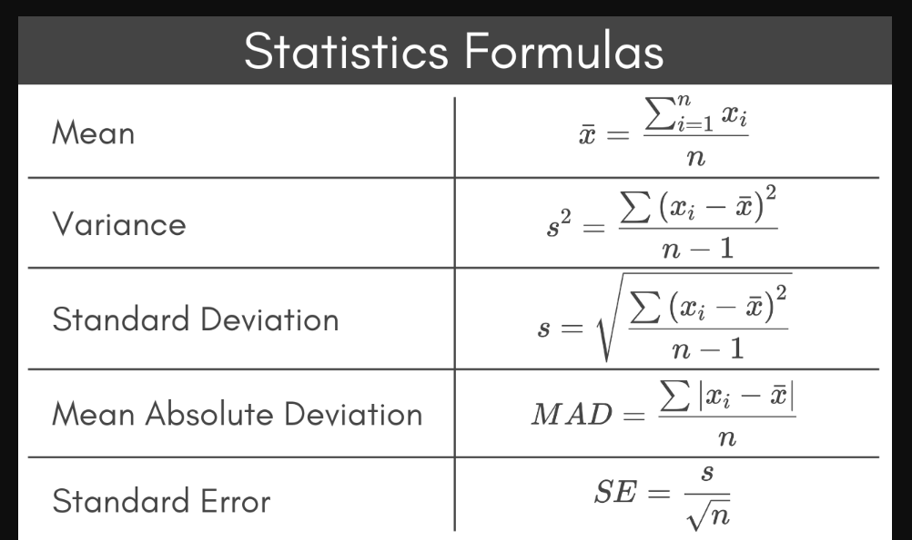

# Mean, Median, Mode, Percentile

**Video:** [Median, Mean, Mode, Percentile | Math, Statistics for data science, machine learning](https://www.youtube.com/watch?v=t4LOv9h-FJM)

**Playlist:** [Mathematics, statistics for data science and machine learning](https://www.youtube.com/playlist?list=PLeo1K3hjS3uuKaU2nBDwr6zrSOTzNCs0l)

These notes cover the first main lesson in the playlist. The focus is on understanding mean, median, mode, and percentile using simple business and data-cleaning examples, followed by basic pandas usage for quantiles and outlier handling.

## What Problem Are We Solving?

Raw numbers are hard to reason about directly. Mean, median, mode, and percentile help summarize a dataset so it becomes easier to answer questions like:

- What is a typical value?
- Is the data skewed?
- Which value occurs most often?
- Where does one value stand relative to the rest?

In data science, these ideas are useful both for analysis and for preprocessing before modeling.

## Core Intuition

Think of these as four different ways to summarize data:

| Concept | Intuition | Best used when |
|---|---|---|
| Mean | The arithmetic average | Data is fairly balanced and outliers are not dominating. |
| Median | The middle value after sorting | Data may contain outliers or skew. |
| Mode | The most frequent value | The most common category or value matters. |
| Percentile | Relative position in sorted data | Ranking, cutoffs, or outlier thresholds matter. |

A useful mental model:

- Mean asks: what is the average?
- Median asks: what is the middle?
- Mode asks: what appears most often?
- Percentile asks: where does this stand relative to everyone else?

## Simple Example

Suppose monthly incomes are:

`[4000, 5000, 6000, 7000, 8000, 9000, 10000000]`

| Measure | Value | Meaning |
|---|---|---|
| Mean | 1,434,571 approx. | Misleading here because one extreme outlier pulls the average upward. |
| Median | 7000 | Middle value after sorting; much closer to the typical income here. |
| 100th percentile | 10,000,000 | Every value is less than or equal to this number. |

This is the classic reason median is often preferred over mean when extreme outliers exist.

## Mean

### Definition

Mean is the arithmetic average.

Formula :

```text
Mean = (sum of all values) / (number of values)
```

### Car showroom example

A simple business question: should a luxury showroom such as BMW open in a town, or would a medium-budget brand such as Honda or Toyota be more realistic? One possible descriptive statistic is average monthly income in that area.

If the average income is genuinely high across the population, a premium showroom may make sense. But if one billionaire is present and everyone else earns normal incomes, the mean can become misleading.

### Where mean fails

If most incomes are between 4000 and 8000, but one value is 10 million, the mean jumps sharply. That can create a wrong business conclusion because the average stops representing the typical resident.

### ML relevance

Mean is useful for quick summarization, feature inspection, and sometimes missing-value imputation when the data is not heavily skewed. But it is sensitive to outliers, so it should not be used blindly.

## Median

### Definition

Median is the middle value after sorting the data.

- If the number of values is odd, take the single middle value.
- If the number of values is even, take the average of the two middle values.

### Why median is robust

Median depends on position, not magnitude. So an extreme value like 10 million may change the mean a lot, while the median can remain stable.

### Loan approval example

Consider a loan approval dataset with features such as `credit_score` and `monthly_income`, and one income value is missing.

| Person | Credit score | Monthly income |
|---|---:|---:|
| A | 650 | 4000 |
| B | 700 | 5000 |
| C | 710 | 6000 |
| D | 680 | NA |
| E | 720 | 7000 |
| F | 690 | 8000 |
| G | 705 | 10000000 |

If mean is used to fill the missing income, the outlier pushes the estimate to an unrealistic level. Median gives a much more reasonable value for imputation in this kind of skewed data.

### Example

Suppose incomes are:

`[4000, 5000, 6000, NaN, 7000, 8000, 10000000]`

A median-based estimate around the middle of the realistic incomes is much more sensible than a mean dominated by the outlier.

### ML relevance

Median is widely useful in preprocessing for skewed numeric features, missing-value imputation, and robust summary statistics. It is especially common when real-world data contains a few extreme values such as high salaries, expensive homes, or very large transactions.

## Percentile

### One-line definition

A percentile is a value below which a given percentage of data points lie.

### Percentile vs percentage

| Term | Meaning |
|---|---|
| Percentage | Score or amount out of 100 |
| Percentile | Relative standing compared with others |

Example: someone can score 75% in an exam and still be at the 100th percentile if nobody else scored higher.

### Important percentiles

| Percentile | Meaning |
|---|---|
| 0th percentile | Minimum value in the dataset |
| 50th percentile | Median |
| 100th percentile | Maximum value in the dataset |

For the income example `[4000, 5000, 6000, 7000, 7500, 8000, 10000000]`, the 100th percentile is 10 million because every value is less than or equal to that value.

### How percentile is used in data science

- Outlier removal by cutting off values above a high percentile such as the 99th percentile.
- Relative scoring in exams such as SAT or GRE.
- Thresholding and exploratory data analysis on income, salary, latency, transaction size, and similar skewed variables.

## Mode

### Definition

Mode is the most frequently occurring value in a dataset.

### Team lunch example

| Cuisine | Votes |
|---|---:|
| Mexican | 5 |
| Italian | 2 |
| Thai | 1 |

The mode is `Mexican` because it appears most often.

### Why mode matters

Mode is useful when the most common choice matters more than the average, especially in categorical data such as favorite cuisine, device type, browser, payment method, or product category.

## Outliers

### One-line definition

An outlier is a data point that is very different from the rest of the data points.

### Why they matter

Outliers can distort summary statistics, especially the mean. In practical ML pipelines, they can also affect feature scaling, model stability, thresholds, and data quality checks.

## Interquartile Range

### Definition

Interquartile Range, or IQR, is the range between the 25th percentile (Q1) and the 75th percentile (Q3).

Formula :

```text
IQR = Q3 - Q1
```

### Why it matters

IQR focuses on the middle 50% of the data, so it is less affected by extreme values than the full range. This makes it a common tool for outlier detection.

### Small example

Suppose sorted incomes are:

`[4, 5, 6, 7, 8, 9, 100]`

A simple approximation gives:

- Q1 around 5.5
- Q3 around 8.5
- IQR around 3

The value `100` sits far away from the middle spread, so it is an obvious outlier candidate.

## Pandas Notes

The video shows pandas operations such as `describe()`, `quantile()`, percentile-based filtering, and filling missing values with median.

### `df.describe()` fields

| Field | Meaning |
|---|---|
| `count` | Number of non-null values |
| `mean` | Arithmetic average |
| `std` | Standard deviation |
| `min` | Minimum value |
| `25%` | 25th percentile, also called Q1 |
| `50%` | 50th percentile, which is the median |
| `75%` | 75th percentile, also called Q3 |
| `max` | Maximum value |

### Quantile examples

| Expression | Meaning |
|---|---|
| `df.income.quantile(0.45)` | 45th percentile of income |
| `df.income.quantile(0.25)` | 25th percentile |
| `df.income.quantile(1)` | 100th percentile, that is the maximum value |

### Interpolation idea

Percentile values can differ slightly depending on the interpolation method.

| Interpolation | Intuition |
|---|---|
| `lower` | Pick the lower neighboring observed value |
| `higher` | Pick the higher neighboring observed value |
| `linear` | Return a value between neighboring points |

That is why percentile calculations may vary slightly across tools or formulas.

## Python Practice Snippets

### 1. Basic summary

```python
import pandas as pd

income = pd.DataFrame({
    'income': [4000, 5000, 6000, 7000, 8000, 9000, 10000000]
})

income.describe()
```

### 2. Quantiles

```python
income['income'].quantile(0.25)
income['income'].quantile(0.45)
income['income'].quantile(1)
```

### 3. Interpolation behavior

```python
income['income'].quantile(0.25, interpolation='lower')
income['income'].quantile(0.25, interpolation='higher')
income['income'].quantile(0.25, interpolation='linear')
```

### 4. Remove high-end outlier using percentile

```python
p99 = income['income'].quantile(0.99)
df_no_outlier = income[income['income'] <= p99]
```

### 5. Fill missing value with median

```python
import numpy as np
import pandas as pd

df = pd.DataFrame({
    'credit_score': [650, 700, 710, 680, 720, 690, 705],
    'income': [4000, 5000, 6000, np.nan, 7000, 8000, 10000000]
})

df['income'] = df['income'].fillna(df['income'].median())
```

## ML Relevance

These concepts appear throughout ML workflows:

- Exploratory data analysis.
- Data cleaning and missing-value handling.
- Outlier detection and removal.
- Feature understanding before training.
- Better decisions about preprocessing.

Without these basics, it becomes harder to understand why model inputs look strange, why training becomes unstable, or why predictions behave unexpectedly.

## Deep Learning Relevance

Even in deep learning, these ideas remain useful:

- Percentiles help with thresholding and clipping extreme values.
- Median helps with robust preprocessing in tabular pipelines.
- Mode helps identify the dominant class in classification datasets.

These topics are small in syntax but important in practice because they shape the quality of data before optimization starts.

## Systems Engineering Relevance

ML systems engineers encounter these ideas in practical pipelines:

- Input validation for training and inference data.
- Monitoring distributions in production.
- Detecting anomalous traffic or skewed payloads.
- Choosing robust fallback values for missing data.

Example: in a loan scoring service, median-based imputation is often safer than mean-based imputation when live traffic may contain extreme income values.

## Common Mistakes

- Using mean even when one or two huge outliers dominate the dataset.
- Forgetting to sort before thinking about median or percentiles.
- Confusing percentile with percentage.
- Using mode for continuous numeric data where repeated exact values may be rare.
- Removing outliers blindly without checking business meaning.

## Easy Explanation: MAD vs Standard Deviation

Imagine two classes both have average score 70.

- In one class, most scores are between 65 and 75.
- In the other, scores range from 43 to 96.

Both classes have the same mean, but the second class is much more spread out.

| Metric | Idea | Why useful |
|---|---|---|
| Mean Absolute Deviation (MAD) | Average of `|x - mean|` | Easy-to-understand average distance from the mean |
| Standard Deviation | Square differences first, average them, then take square root | Reacts more strongly to larger deviations |

Formulas :

```text
MAD = (1/n) * sum(|x_i - mean|)
```

```text
Standard deviation (sigma) = sqrt((1/n) * sum((x_i - mean)^2))
```

Standard deviation becomes especially important later for normal distribution, z-score, scaling, and many ML methods.



## Easy Explanation: L1, L2, Lasso, Ridge

These are not the main focus of this first lesson, but they connect naturally to the idea of distance and deviation.

### Distance intuition

| Term | Intuition |
|---|---|
| L1 norm | Add absolute differences; like moving on city blocks |
| L2 norm | Straight-line distance based on squared differences |

### Regression connection

| Method | Penalty idea | What it tends to do |
|---|---|---|
| Lasso regression | Adds L1 penalty to the loss | Can shrink some coefficients exactly to zero, so it performs feature selection |
| Ridge regression | Adds L2 penalty to the loss | Shrinks coefficients smoothly, but usually not to exactly zero |
| Elastic Net | Mix of L1 and L2 | Useful when both sparsity and stability matter |

Simple intuition: regularization adds a penalty for being too complex. Lasso can remove some features entirely, while Ridge keeps features but reduces their influence.

## Key Takeaways

- Mean is useful, but it is sensitive to extreme values.
- Median is safer when the data is skewed or contains outliers.
- Percentile tells relative position, not raw score.
- 50th percentile is the median.
- 100th percentile is the maximum value.
- Mode is the most frequent value.
- IQR is the spread from the 25th to the 75th percentile.
- These ideas are foundational for EDA, preprocessing, and robust ML pipelines.

## Revision Cheat Sheet

- **Mean** = average
- **Median** = middle after sorting
- **Mode** = most frequent value
- **Percentile** = relative standing in sorted data
- **Outlier** = value very different from the rest
- **IQR** = Q3 - Q1
- Use **median** when outliers distort the mean
- Use high or low **percentiles** for outlier filtering

## 30-Second Revision

Mean summarizes with an average, but it can get distorted by outliers. Median gives the middle value and is often more reliable in skewed real-world data. Mode tells the most common value, and percentile tells how a value ranks relative to the rest.

## 2-Minute Revision

In business or ML, mean is good only when the dataset is not dominated by extreme values. Median is robust because it depends on order, not magnitude, which makes it useful for income data and missing-value imputation. Percentiles help with ranking and outlier cutoffs, while mode helps identify the most frequent category or value.

## Interview Perspective

Common interview question: when would median be preferred over mean?

A strong answer: use median when the data is skewed or contains outliers, because mean is sensitive to extreme values while median is robust.

Another common question: what is the difference between percentage and percentile?

- Percentage is an absolute score out of 100.
- Percentile is a relative ranking compared with others.

## Engineering Perspective

In production pipelines, these are not just textbook definitions. They help decide how to summarize monitoring data, handle missing values, choose safer defaults, and filter suspicious records before model training or inference.

## Next Topic Recommendation

The best next topic after this lesson is spread: mean absolute deviation and standard deviation. Once the center of data is clear, the next question is how far data points spread around that center.
