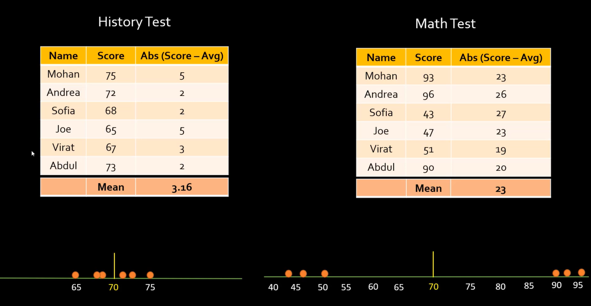
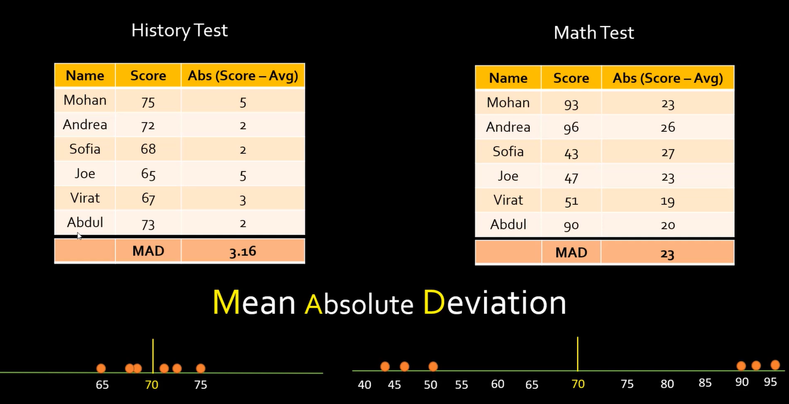
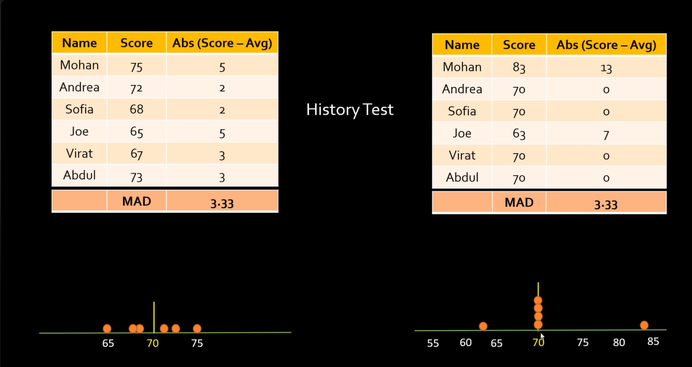
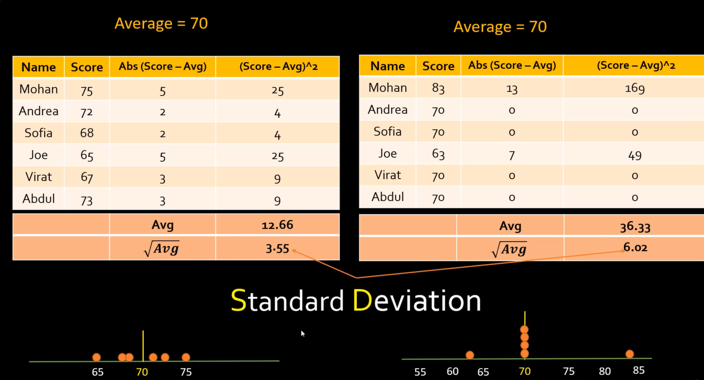

# Standard Deviation and Mean Absolute Deviation

**Video:** [What is Standard Deviation and Mean Absolute Deviation | Math, Statistics for data science, ML](https://www.youtube.com/watch?v=yCDevFTNbC0)

**Playlist:** [Mathematics, statistics for data science and machine learning](https://www.youtube.com/playlist?list=PLeo1K3hjS3uuKaU2nBDwr6zrSOTzNCs0l)

This note covers the second main concept in the playlist: how to measure how far data points are from the average. The video explains this using simple test-score examples and builds from mean absolute deviation to standard deviation.

## What Problem Are We Solving?

Knowing the average of a dataset is useful, but it is not enough.

Two datasets can have the same mean and still behave very differently:

- One dataset may have values tightly packed around the mean.
- Another may have values spread far away from the mean.

So the real question is:

**How far apart are individual data points from the average?**

That idea is called **spread** or **dispersion**, and both MAD and standard deviation are ways to measure it.

## Core Intuition

Suppose two classes both have average score 70.

| Dataset | Scores stay near average? | What it means |
|---|---|---|
| History test | Yes | Students scored fairly consistently |
| Math test | No | Scores are much more spread out |

Even though both have the same mean, they do not have the same distribution. This is why data science needs a numeric way to measure spread.

## Simple Example

### History test

Scores:

`[75, 72, 68, 65, 70, 70]`

Mean:

```text
Mean = (75 + 72 + 68 + 65 + 70 + 70) / 6 = 70
```

These values are all fairly close to 70.

### Math test

Scores:

`[96, 43, 72, 67, 74, 68]`

Mean:

```text
Mean = (96 + 43 + 72 + 67 + 74 + 68) / 6 = 70
```

This dataset has the same mean, but values are much more spread out.

That is the exact motivation for MAD and standard deviation.

**Useful**





**less relevant to use**



**Using standard deviation over MAD makes more sense**



## Mean Absolute Deviation

### Definition

Mean Absolute Deviation, or **MAD**, measures the average absolute distance of data points from the mean.

Formula :

```text
MAD = (1/n) * sum(|x_i - mean|)
```

### Step-by-step idea

1. Find the mean.
2. Subtract the mean from each value.
3. Take the absolute value, so negatives do not cancel positives.
4. Average those absolute distances.

### History test example

Scores:

`[75, 72, 68, 65, 70, 70]`

Mean = 70

| Score | Score - Mean | Absolute deviation |
|---|---:|---:|
| 75 | 5 | 5 |
| 72 | 2 | 2 |
| 68 | -2 | 2 |
| 65 | -5 | 5 |
| 70 | 0 | 0 |
| 70 | 0 | 0 |

```text
MAD = (5 + 2 + 2 + 5 + 0 + 0) / 6
    = 14 / 6
    = 2.33
```

### Math test example

Scores:

`[96, 43, 72, 67, 74, 68]`

Mean = 70

| Score | Score - Mean | Absolute deviation |
|---|---:|---:|
| 96 | 26 | 26 |
| 43 | -27 | 27 |
| 72 | 2 | 2 |
| 67 | -3 | 3 |
| 74 | 4 | 4 |
| 68 | -2 | 2 |

```text
MAD = (26 + 27 + 2 + 3 + 4 + 2) / 6
    = 64 / 6
    = 10.67
```

The second dataset has a much larger MAD, so its points are more spread out from the mean.

## Why MAD Helps

MAD gives one simple number that summarizes average distance from the center.

| MAD value | Meaning |
|---|---|
| Small | Data points stay close to the mean |
| Large | Data points are more spread out |

This is already very useful in exploratory data analysis.

## Where MAD Can Fall Short

The video also explains an important limitation.

Two datasets can have the same MAD, but still have different distributions. For example:

| Dataset A | Dataset B |
|---|---|
| Most points are moderately away from mean | Most points are near mean, but one or two are very far away |

MAD may treat them as similar because it averages absolute distances evenly. But intuitively, Dataset B feels riskier or more irregular because of the extreme deviation.

That is where standard deviation becomes more useful.

## Standard Deviation

### Definition

Standard deviation measures spread by giving more weight to larger deviations.

Formula :

```text
Standard deviation (sigma) = sqrt((1/n) * sum((x_i - mean)^2))
```

### Why squaring helps

Instead of taking absolute differences, standard deviation squares the differences.

That means:

- Small deviations stay small.
- Large deviations become much larger.

So standard deviation reacts more strongly when the data contains points that are far away from the mean.

## Step-by-step Standard Deviation Example

Use the history test scores again:

`[75, 72, 68, 65, 70, 70]`

Mean = 70

| Score | Score - Mean | Squared deviation |
|---|---:|---:|
| 75 | 5 | 25 |
| 72 | 2 | 4 |
| 68 | -2 | 4 |
| 65 | -5 | 25 |
| 70 | 0 | 0 |
| 70 | 0 | 0 |

```text
Average of squared deviations = (25 + 4 + 4 + 25 + 0 + 0) / 6
                              = 58 / 6
                              = 9.67

Standard deviation = sqrt(9.67)
                   = 3.11 approx.
```

Now compare with the math test:

`[96, 43, 72, 67, 74, 68]`

Mean = 70

| Score | Score - Mean | Squared deviation |
|---|---:|---:|
| 96 | 26 | 676 |
| 43 | -27 | 729 |
| 72 | 2 | 4 |
| 67 | -3 | 9 |
| 74 | 4 | 16 |
| 68 | -2 | 4 |

```text
Average of squared deviations = (676 + 729 + 4 + 9 + 16 + 4) / 6
                              = 1438 / 6
                              = 239.67

Standard deviation = sqrt(239.67)
                   = 15.48 approx.
```

This makes the spread difference much more obvious.

## MAD vs Standard Deviation

| Metric | Uses absolute or squared difference? | Effect of large outliers | Main intuition |
|---|---|---|---|
| MAD | Absolute difference | Moderate | Average distance from mean |
| Standard deviation | Squared difference | Stronger | Spread, with more emphasis on large deviations |

A simple way to remember it:

- MAD is easier to understand.
- Standard deviation is more sensitive to large deviations.

## Why Standard Deviation Is Used So Much

Standard deviation appears everywhere in statistics and machine learning because many important techniques depend on how far values are from the mean.

Common uses:

- Understanding data spread
- Detecting unusual values
- Normal distribution
- Z-score
- Feature scaling and normalization
- Model diagnostics

That is why this topic is foundational and keeps showing up later.

## Easy Scenario Where Standard Deviation Is Better

Imagine two support teams with the same average ticket resolution time: 30 minutes.

| Team | Resolution times |
|---|---|
| Team A | Mostly between 28 and 32 minutes |
| Team B | Many around 30, but a few take 5 or 90 minutes |

Both teams may have the same average. But Team B is less stable.

Standard deviation highlights that instability better because it penalizes extreme deviations more strongly.

## Data Science Relevance

In data science, measures of spread are useful for:

- Understanding how noisy a feature is
- Comparing stability across datasets
- Spotting extreme behavior
- Preprocessing before training models
- Reasoning about thresholds and anomaly detection

A mean alone tells only the center. Spread tells how trustworthy or variable that center is.

## Deep Learning Relevance

In deep learning, standard deviation shows up in practical places such as:

- Weight initialization
- Batch normalization intuition
- Monitoring activations
- Understanding feature scaling
- Debugging unstable training

If values are too widely spread, optimization may become harder.

## Systems Engineering Relevance

For ML systems and production pipelines, these ideas matter in:

- Monitoring latency distributions
- Detecting anomalous request sizes
- Tracking drift in feature values
- Comparing stability across model versions
- Setting safer thresholds in production alerts

Example: two models may have the same average inference latency, but one may have much higher spread. That model is riskier in production because tail latency is worse.

## L1 and L2 Connection

The video briefly connects these ideas to ML terminology.

| Term | Intuition | Related idea |
|---|---|---|
| L1 | Uses absolute values | Similar spirit to MAD |
| L2 | Uses squared values | Similar spirit to standard deviation |

This is also why people often connect:

- **Lasso regression** with L1-style penalty
- **Ridge regression** with L2-style penalty

Simple intuition:

- L1 cares about absolute size.
- L2 cares more about larger values because of squaring.

## Common Mistakes

- Thinking same mean means same dataset behavior.
- Using only average and ignoring spread.
- Forgetting that standard deviation reacts more strongly to large deviations.
- Treating MAD and standard deviation as interchangeable in all cases.
- Ignoring the effect of outliers when interpreting spread.

## Key Takeaways

- Mean tells the center of data.
- MAD tells average absolute distance from the mean.
- Standard deviation tells spread with stronger emphasis on large deviations.
- Two datasets can have the same mean but very different spread.
- Standard deviation is one of the most important statistics in ML and data science.

## Revision Cheat Sheet

- **Mean** = center
- **MAD** = average absolute distance from center
- **Standard deviation** = spread using squared distance
- Small spread = values cluster near mean
- Large spread = values are far from mean
- Standard deviation reacts more strongly to extreme values than MAD

## 30-Second Revision

Mean tells where the data is centered. MAD tells the average distance from that center. Standard deviation also measures distance from the center, but it punishes large deviations more strongly, so it captures spread more effectively when outliers or wide variation exist.

## 2-Minute Revision

Two datasets can share the same average and still be very different. MAD helps summarize average distance from the mean, which makes it useful for understanding spread. Standard deviation improves on this by squaring deviations, which makes large deviations matter more and gives a better signal when data is widely spread or contains extreme points.

## Interview Perspective

Common interview question: why is standard deviation often preferred over MAD?

A strong answer: because standard deviation gives more weight to larger deviations, so it better captures spread when extreme values matter.

Another common question: can two datasets have the same mean but different standard deviation?

Yes. Same mean only says where data is centered; standard deviation says how spread out the values are.

## Engineering Perspective

In real systems, averages alone are often misleading. Spread matters for reliability. A service with average latency of 100 ms can still be bad if its latency is highly inconsistent. Standard deviation helps quantify that inconsistency.

## Next Topic Recommendation

The next natural topic is normal distribution and z-score. Once spread is understood, the next step is learning how values behave in a distribution and how far a point is from the mean in standard-deviation terms.
