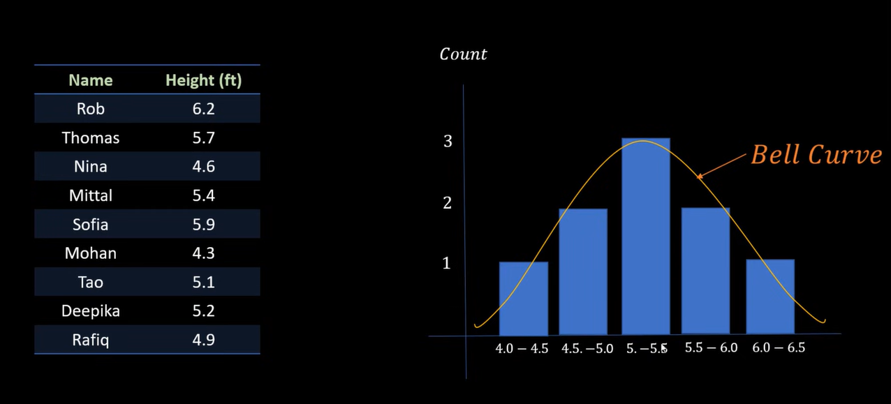
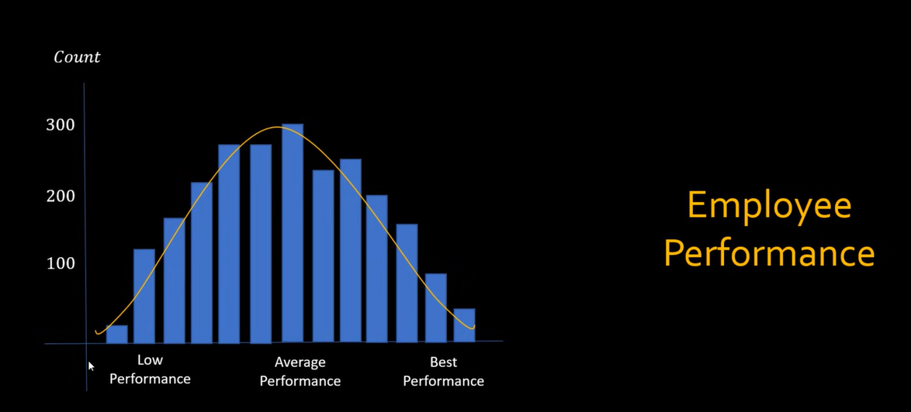
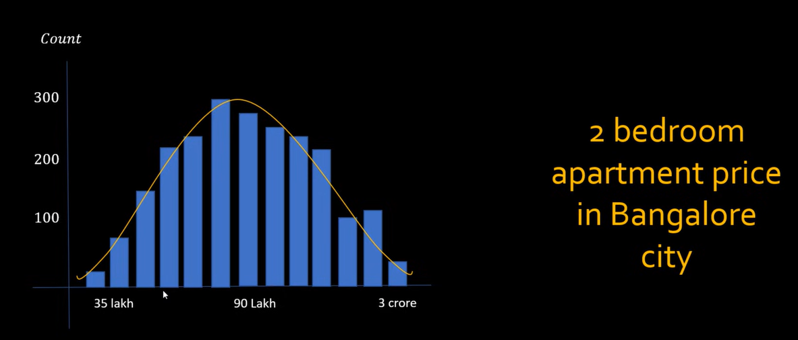
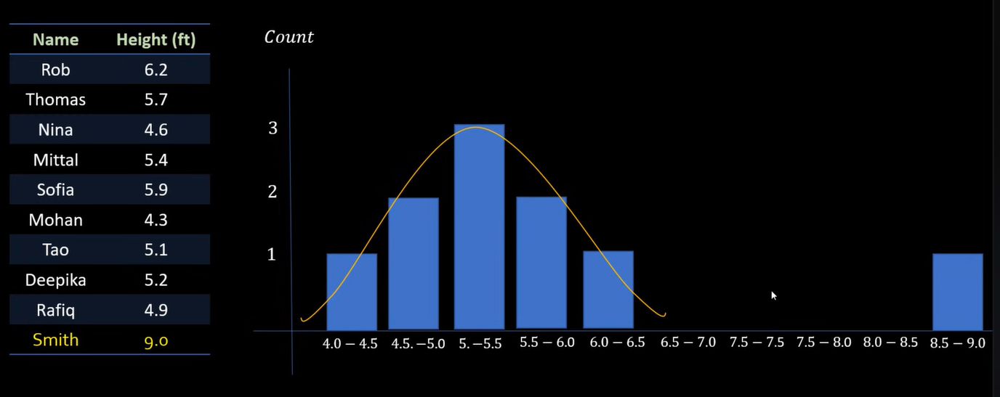
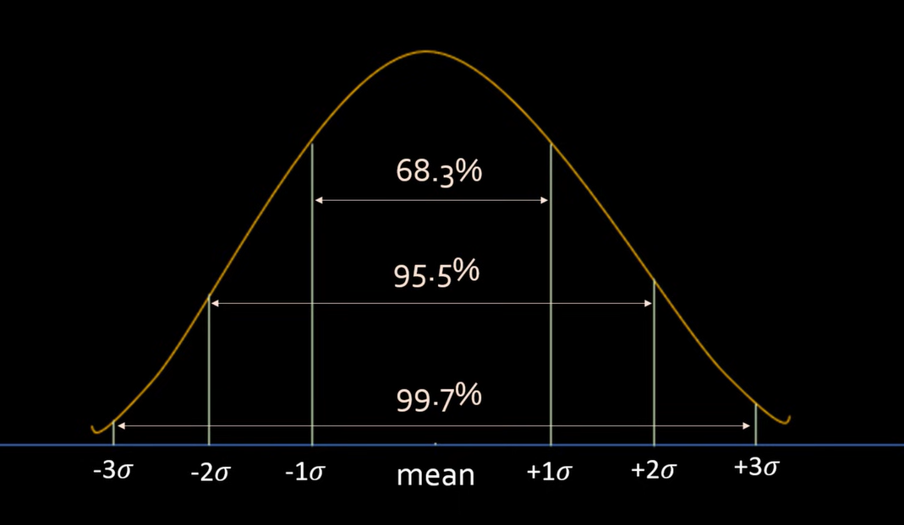
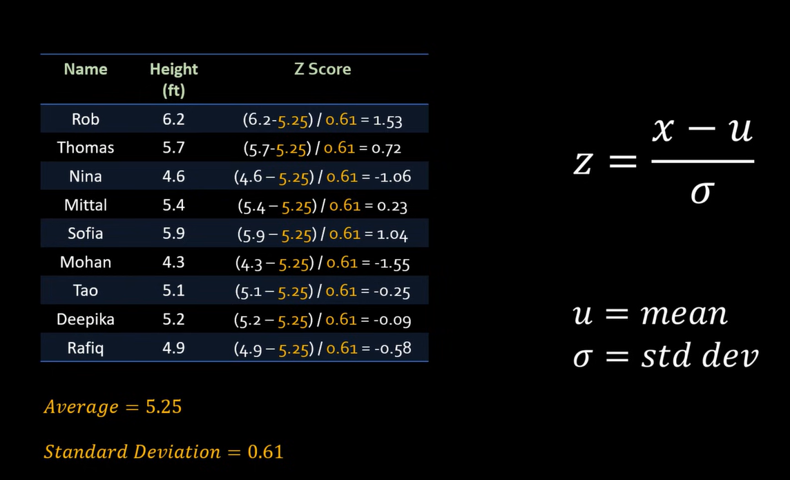

# Normal Distribution and Z Score

**Video:** [Normal Distribution and Z Score | Math, Statistics for data science, machine learning](https://www.youtube.com/watch?v=okhrFgaUwio)

**Playlist:** [Mathematics, statistics for data science and machine learning](https://www.youtube.com/playlist?list=PLeo1K3hjS3uuKaU2nBDwr6zrSOTzNCs0l)

This note covers normal distribution, outlier removal using standard deviation, and z-score. The main goal is to understand why many real-world datasets form a bell-shaped pattern and how that helps in data cleaning and ML workflows.

## What Problem Are We Solving?

Many real-world datasets are not random noise. They often have a pattern where:

- Most values are near the average.
- Fewer values are far away from the average.
- Very extreme values are rare.

When data behaves like this, it often resembles a **normal distribution**.

This matters because once the shape is understood, it becomes easier to:

- Detect unusual values
- Remove outliers
- Standardize features
- Compare values across datasets
- Build cleaner ML pipelines

## Core Intuition

Normal distribution is also called **Gaussian distribution**. It is the familiar bell-shaped curve.

If a dataset follows this pattern, then:

- The middle contains most data points.
- The left and right tails contain fewer data points.
- Values become less common as they move farther from the mean.

A simple visual intuition:

```text
                most values
                    /
                   /  \
                  /    \
                 /      \
----------------/--------\----------------
             low   mean    high
```

The peak is around the average, and frequency drops as we move away from that center.

## Histogram and Bell Curve

The video starts with a histogram idea.

A **histogram** shows how many data points fall into a given range.

Example with heights:

| Height range (ft) | Count |
|---|---:|
| 4.5 - 5.0 | 2 |
| 5.0 - 5.5 | 8 |
| 5.5 - 6.0 | 15 |
| 6.0 - 6.5 | 10 |
| 6.5 - 7.0 | 3 |

If a smooth curve is drawn over such a histogram, it may look like a bell. That is the normal distribution intuition used in the video.







## Real-World Examples

The video explains that many natural or business datasets often approximately follow normal distribution.

| Example | Why it often looks normal |
|---|---|
| Human height | Most people are around average height, very short or very tall people are fewer |
| Apartment prices in one city segment | Most properties cluster near a common range, extreme cheap or expensive homes are fewer |
| Test scores in a class | Most students score in a middle range, few score very low or very high |
| Employee performance ratings | Most employees are average, few are exceptional or very weak |

This is not a guarantee for every dataset, but it is a very common pattern in practice.

## Why Normal Distribution Matters

Once a dataset is roughly normal, standard deviation becomes very useful for reasoning about how far values are from the mean.

That makes it practical for:

- Outlier detection
- Data cleaning
- Exploratory data analysis
- Feature standardization
- Probability-based reasoning

A big idea from the video is that **distribution shape helps decide what cleaning or analysis method to use**.



## Standard Deviation Ranges

The video connects normal distribution with the familiar 1-sigma, 2-sigma, and 3-sigma ranges.

| Range around mean | Approx. % of data in a normal distribution |
|---|---:|
| Mean ± 1 standard deviation | 68.3% |
| Mean ± 2 standard deviations | 95.5% |
| Mean ± 3 standard deviations | 99.7% |

This is often called the **68-95-99.7 rule**.

That means in a roughly normal dataset, almost all values should lie within 3 standard deviations of the mean.



## Outlier Intuition

An **outlier** is a value that is unusually far from the rest of the data.

The video gives a height example: if most people are around 5 to 6.5 feet tall, then a recorded height of 9 feet is suspicious.

Possible reasons:

- Data entry mistake
- Data transmission error
- Measurement issue
- Rare but valid extreme case

In data science, outliers should not be ignored blindly. They should be checked and then removed, capped, or otherwise treated depending on the problem.

## Outlier Removal Using 3 Standard Deviations

A common guideline from the video:

- Values below `mean - 3 * std` may be treated as outliers.
- Values above `mean + 3 * std` may be treated as outliers.

Formula:

```text
Lower limit = mean - 3 * standard deviation
Upper limit = mean + 3 * standard deviation
```

Values outside this range are unusual in a normal distribution.

### Height example

Suppose a dataset has:

- Mean height = 66.36 inches
- Standard deviation = 3.84 inches

Formula:

```text
Lower limit = 66.36 - 3 * 3.84 = 54.84 approx.
Upper limit = 66.36 + 3 * 3.84 = 77.88 approx.
```

Any value below about `54.84` or above about `77.88` can be treated as an outlier using the 3-sigma rule.

## Small Table Example

| Height (inches) | Interpretation |
|---|---|
| 65 | Normal range |
| 70 | Normal range |
| 77 | Still within upper normal range |
| 78.5 | Likely outlier |
| 52 | Likely outlier |

This is the same idea demonstrated in the video using a larger dataset.

## Python Idea Used in the Video

The video uses pandas and seaborn to inspect the distribution and remove outliers.

### 1. Inspect summary statistics

```python
df.height.describe()
```

This helps get:

- count
- mean
- std
- min
- max
- percentiles

### 2. Plot histogram with curve

```python
import seaborn as sns
sns.histplot(df.height, kde=True)
```

This helps check whether the distribution looks roughly bell-shaped.

### 3. Compute limits

```python
mean = df.height.mean()
std = df.height.std()

lower_limit = mean - 3 * std
upper_limit = mean + 3 * std
```

### 4. Find outliers

```python
outliers = df[(df.height < lower_limit) | (df.height > upper_limit)]
```

### 5. Remove outliers

```python
df_no_outlier = df[(df.height > lower_limit) & (df.height < upper_limit)]
```

This is a simple and practical data-cleaning workflow.

## What Is Z Score?

Z-score answers a very specific question:

**How many standard deviations away is a data point from the mean?**

That is all z-score really means.

If:

- a point is exactly at the mean, its z-score is `0`
- a point is one standard deviation above the mean, its z-score is `1`
- a point is two standard deviations below the mean, its z-score is `-2`

## Z Score Formula

Formula:

```text
z = (x - mean) / standard deviation
```

Where:

- `x` = the data point
- `mean` = average of the dataset
- `standard deviation` = spread of the dataset

## Z Score Intuition Table

| Z-score | Meaning |
|---|---|
| 0 | Exactly at the mean |
| 1 | One standard deviation above mean |
| -1 | One standard deviation below mean |
| 2.5 | Two and a half standard deviations above mean |
| -3 | Three standard deviations below mean |

A large positive z-score means the value is far above average. A large negative z-score means the value is far below average.

## Simple Z Score Example

Suppose:

- Mean height = 66.36 inches
- Standard deviation = 3.84 inches
- Person's height = 74 inches

Formula:

```text
z = (74 - 66.36) / 3.84
  = 7.64 / 3.84
  = 1.99 approx.
```

Interpretation: this height is about 2 standard deviations above the mean.

## Another Z Score Example

Suppose a score is 58 where:

- Mean = 70
- Standard deviation = 6

Formula:

```text
z = (58 - 70) / 6
  = -12 / 6
  = -2
```

This means the score is 2 standard deviations below the mean.



## Z Score for Outlier Detection

Z-score makes outlier detection even easier because the threshold becomes standardized.

Common rule:

- `z < -3` or `z > 3` → likely outlier

This is equivalent to the earlier 3-standard-deviation rule.

## Python Idea for Z Score

The video creates a new `zscore` column in the dataframe.

```python
df['zscore'] = (df.height - df.height.mean()) / df.height.std()
```

Then outliers can be filtered directly:

```python
outliers = df[(df.zscore < -3) | (df.zscore > 3)]
```

And the clean dataset becomes:

```python
df_no_outlier = df[(df.zscore > -3) & (df.zscore < 3)]
```

This is often easier to reason about than manually checking raw units.

## Standard Deviation vs Z Score

| Concept | What it tells |
|---|---|
| Standard deviation | How spread out the full dataset is |
| Z-score | How far one specific data point is from the mean |

A good mental model:

- Standard deviation describes the dataset.
- Z-score describes a single point relative to that dataset.

## Why This Matters in Data Science

These concepts are used a lot in data science because they help with data understanding and cleaning.

Common uses:

- Detecting outliers
- Comparing values across different scales
- Standardizing features
- Understanding whether a value is unusual
- Cleaning raw real-world datasets before training models

Without this, noisy or extreme data points can distort training and analysis.

## Deep Learning Relevance

Even in deep learning, these ideas are useful:

- Standardization often uses mean and standard deviation.
- Extreme values can destabilize training.
- Activation distributions are often monitored using spread-based statistics.
- Understanding data distribution helps with preprocessing and normalization.

These topics are basic, but they sit underneath many practical DL workflows.

## Systems Engineering Relevance

For ML systems and production workflows, these ideas show up in:

- Detecting anomaly spikes in request volume
- Monitoring latency distributions
- Checking drift in incoming features
- Identifying suspicious sensor readings
- Creating alert thresholds based on deviation from baseline

Example: if inference latency suddenly has a z-score above 3 compared to normal traffic, that may indicate a production issue.

## Common Mistakes

- Assuming every dataset is normally distributed.
- Applying the 3-sigma rule blindly to highly skewed data.
- Confusing standard deviation of a dataset with z-score of one point.
- Removing outliers without checking whether they are valid business cases.
- Forgetting that z-score depends on both mean and standard deviation.

## Key Takeaways

- Normal distribution is the bell-shaped pattern where most values cluster near the mean.
- Many real-world datasets approximately follow this shape.
- In a normal distribution, about 68.3%, 95.5%, and 99.7% of data falls within 1, 2, and 3 standard deviations of the mean.
- Outliers can often be detected using the 3-standard-deviation rule.
- Z-score tells how many standard deviations a specific point is from the mean.
- Standard deviation describes spread; z-score describes relative position.

## Revision Cheat Sheet

- **Normal distribution** = bell curve
- **Mean** = center of the distribution
- **Standard deviation** = spread around the center
- **Z-score** = number of standard deviations from mean
- **3-sigma rule** = common guideline for outlier detection
- `z > 3` or `z < -3` = likely outlier

## 30-Second Revision

Normal distribution means most values cluster around the average and fewer values appear as we move away from the center. Standard deviation measures the spread of the dataset, and z-score tells how far one value is from the mean in standard-deviation units. These are especially useful for outlier detection and data cleaning.

## 2-Minute Revision

Many natural datasets, such as heights or test scores, approximately follow a bell-shaped curve. In such datasets, most values are near the mean, and extreme values are rare. Standard deviation tells how spread out the data is, while z-score tells how unusual a particular value is. This is why both are used heavily in preprocessing, anomaly detection, and feature standardization.

## Interview Perspective

Common interview question: what is the difference between standard deviation and z-score?

A strong answer:

- Standard deviation measures how spread out the dataset is.
- Z-score measures how far one data point is from the mean in standard deviation units.

Another common question: when is the 3-sigma rule useful?

It is useful when the data is approximately normal and there is a need to flag unusually far values as possible outliers.

## Engineering Perspective

In real systems, averages alone are often not enough. A value may look normal in raw units but still be abnormal relative to system behavior. Z-score gives a scale-independent way to judge how unusual a value is, which is useful in monitoring, alerting, and anomaly detection.

## Next Topic Recommendation

The next natural step is logarithm or log-normal distribution. After learning how normal distributions behave, it becomes easier to understand why some real-world quantities are not symmetric and why log transforms are so common in data science.
