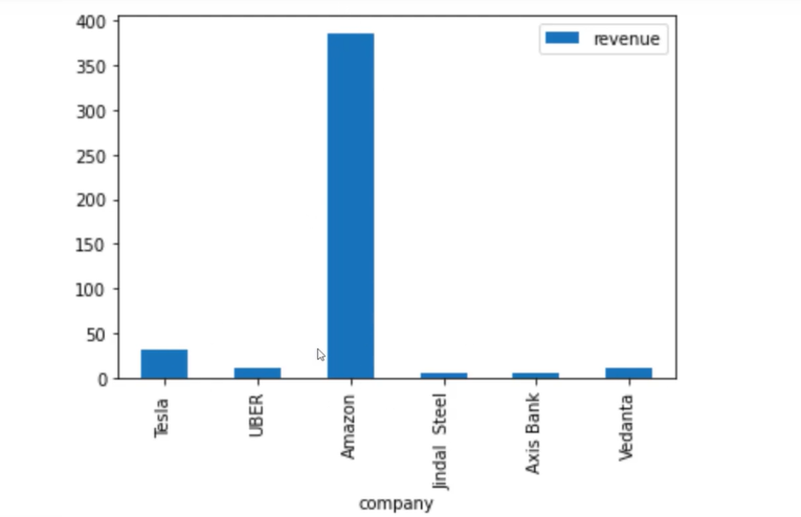
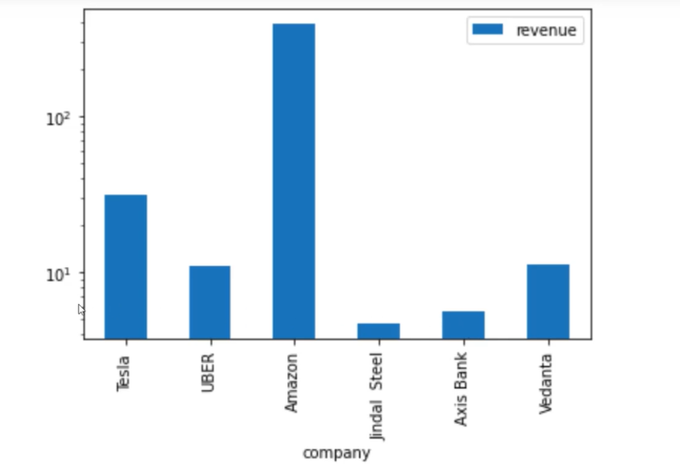
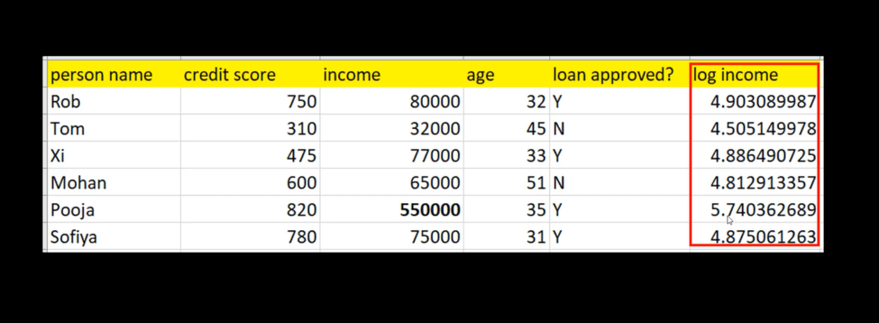

# What is Logarithm?

**Video:** [What is logarithm? | Math, Statistics for data science, machine learning](https://www.youtube.com/watch?v=KzQQCtgzQbw)

**Playlist:** [Mathematics, statistics for data science and machine learning](https://www.youtube.com/playlist?list=PLeo1K3hjS3uuKaU2nBDwr6zrSOTzNCs0l)

This note covers logarithms, why they are the inverse of exponents, and how they help with comparison and feature transformation in data science and machine learning.

## What Problem Are We Solving?

Sometimes values grow very fast, and raw numbers become hard to compare. Logarithms help us work backward from a large value to the smaller base that created it.

In data science, logarithms are also useful when one feature is much larger than the others, because they compress large values and make comparison easier.

## Core Intuition

Exponentiation is repeated multiplication.

If a bank gives a 5x return every year:

- Start with 5, after 1 year you have 25.
- After 2 years you have 125.
- After 3 years you have 625.

Logarithm answers the reverse question: if you already have 125, how many times did the 5x growth happen?

## Exponent and Log

### Exponent

Formula:

```text
5^2 = 25
5^3 = 125
```

### Logarithm

Formula:

```text
log_5(125) = 3
```

This means 5 raised to the power 3 gives 125.

### Important identity

Formula:

```text
log_b(b) = 1
```

Examples:

```text
log_10(10) = 1
log_10(100) = 2
log_10(1000) = 3
```

The video uses this to show that logarithm is the inverse of exponentiation.

## Simple Real-Life Example

Imagine a magic bank:

- You put in 5 dollars.
- Every year, it multiplies by 5.

| Year | Amount |
|---|---:|
| 0 | 5 |
| 1 | 25 |
| 2 | 125 |
| 3 | 625 |

If you ask, “How many years will it take to reach 125?”, the answer is 3. That is exactly what the log function gives.

## Why Log Helps in Data Analysis

The video shows a company revenue example where one company, Amazon, has revenue much larger than the others.

| Company | Revenue |
|---|---:|
| Tesla | 31.0 |
| UBER | 11.0 |
| Amazon | 386.0 |
| Jindal Steel | 4.7 |
| Axis Bank | 5.6 |
| Vedanta | 11.3 |

If you plot these on a normal scale, Amazon dominates the chart and makes the smaller bars hard to compare.



## Log Scale Comparison

Using a log scale makes the smaller values more visible.

| Company | Original revenue | Log-scaled idea |
|---|---:|---:|
| Amazon | 386.0 | Still large, but less dominating |
| Axis Bank | 5.6 | Easier to compare with nearby values |
| Jindal Steel | 4.7 | No longer visually crushed by the largest bar |



This is why log axes are commonly used in plots when values vary by orders of magnitude.

## Data Science Example: Log Transform

The video shows a loan approval dataset with features like credit score, income, age, and loan approval label.

| Person | Credit score | Income | Age | Loan approved? |
|---|---:|---:|---:|---|
| Rob | 750 | 80000 | 32 | Y |
| Tom | 310 | 32000 | 45 | N |
| Xi | 475 | 77000 | 33 | Y |
| Mohan | 600 | 65000 | 51 | N |
| Pooja | 820 | 550000 | 35 | Y |
| Sofiya | 780 | 75000 | 31 | Y |

Pooja’s income is much larger than the others, and that can distort model training.

### Why this is a problem

A model may get biased toward very large numeric values if the feature scale is too uneven. In this case, income can overpower the learning process.

### Log transform helps

Take the log of income:

| Person | Income | Log income |
|---|---:|---:|
| Rob | 80000 | 4.903089987 |
| Tom | 32000 | 4.505149978 |
| Xi | 77000 | 4.886490725 |
| Mohan | 65000 | 4.812913357 |
| Pooja | 550000 | 5.740362689 |
| Sofiya | 75000 | 4.875061263 |

Now the values are more comparable, which often helps models behave more fairly.



## When Log Is Useful

| Situation | Why log helps |
|---|---|
| Very large and very small values in the same feature | Compresses range and improves comparison |
| Skewed numeric data | Reduces extreme dominance |
| Visualization | Makes charts easier to read |
| Machine learning input features | Can reduce bias from magnitude differences |
| Earthquake scales | Works naturally for multiplicative growth |

## Earthquake Example

The video mentions earthquake magnitude as another logarithmic scale example.

| Scale change | Meaning |
|---|---|
| 5 vs 4 | 5 is 10 times more powerful than 4 |
| 6 vs 5 | 6 is 10 times more powerful than 5 |

This is useful because it shows that logarithmic scales are often used when each step represents a multiplicative jump rather than an additive one.

## Python Idea From The Video

The notebook in the video loads revenue data and plots it with and without a log scale.

```python
import pandas as pd

df = pd.read_csv('revenue.csv')
df.plot(x='company', y='revenue', kind='bar', logy=True)
```

For machine learning, the same idea is used as a feature transform:

```python
df['log_income'] = np.log10(df['income'])
```

This creates a new column that is easier for the model to work with.

## Log Base 10

The video mostly uses base 10 logarithms.

Formula:

```text
log_10(10) = 1
log_10(100) = 2
log_10(1000) = 3
```

Base 10 is easy to read because each step is a power of 10.

## ML Relevance

Log transforms are common in ML because many real-world features are skewed.

Examples:

- Income
- Population
- Revenue
- Number of visits
- Sales volume

Applying log can make these features more stable and more comparable.

## Deep Learning Relevance

Logarithms appear in deep learning through:

- Log loss
- Cross-entropy loss
- Softmax stability
- Numerical transformations in preprocessing

So log is not only a charting trick. It is also part of how many learning objectives are defined.

## Systems Engineering Relevance

In ML systems, log transforms can improve:

- Feature pipelines
- Monitoring dashboards
- Anomaly detection
- Business metric comparison
- Storage and analytics on highly skewed data

A system that handles traffic, revenue, or latency often benefits from log-based views because raw values may be too spread out to compare directly.

## Common Mistakes

- Thinking log means “smaller” without understanding why.
- Using log on zero or negative values without proper handling.
- Forgetting that log changes interpretation, not just scale.
- Applying log everywhere, even when the feature is already balanced.
- Confusing log compression with data loss.

## Key Takeaways

- Logarithm is the inverse of exponentiation.
- It tells you the power needed to produce a number from a base.
- Log scales help compare values that differ greatly in magnitude.
- Log transforms are useful in data analysis and machine learning.
- Log is often used for skewed numeric features and stable visualization.

## Revision Cheat Sheet

- **Exponent** = repeated multiplication
- **Logarithm** = inverse of exponent
- **log_b(b) = 1**
- **log scale** = compresses large values
- **Log transform** = makes skewed data more comparable
- **Use log** when values vary across orders of magnitude

## 30-Second Revision

Logarithm is the inverse of exponentiation. It tells us what power of a base gives a particular number. In data science, log helps compress large values so skewed data becomes easier to compare and model.

## 2-Minute Revision

If exponentiation grows values quickly, logarithm works backward from the result to the exponent. This is useful when one feature is much larger than others, like revenue or income, because a log transform makes the values more comparable. That is why log scales are common in plots and log transforms are common in machine learning preprocessing.

## Interview Perspective

Common interview question: why do we use log transform?

A strong answer: to reduce skew, compress large values, and make features more comparable so analysis and model training become more stable.

Another common question: why is logarithm called the inverse of exponentiation?

Because it answers the reverse question: instead of asking what value comes from a power, it asks what power produced the value.

## Engineering Perspective

In production systems, raw metrics can be too wide in range to compare directly. Log transforms help with dashboards, anomaly detection, feature engineering, and model stability whenever numbers vary heavily in magnitude.

## Next Topic Recommendation

The next topic is log-normal distribution, which builds directly on logarithms and explains why some right-skewed datasets become more normal after applying log.
