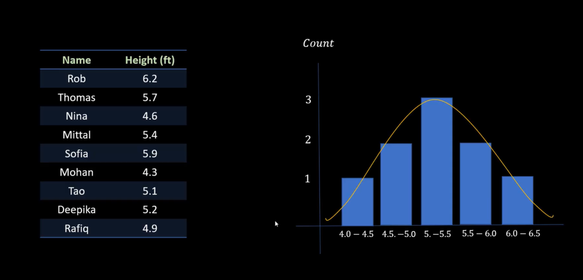
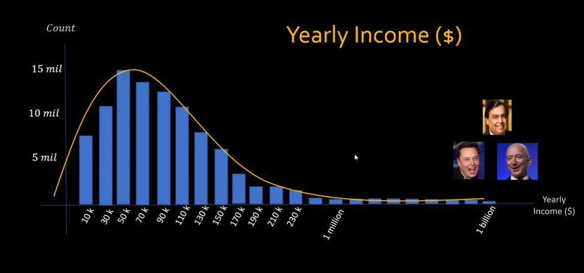
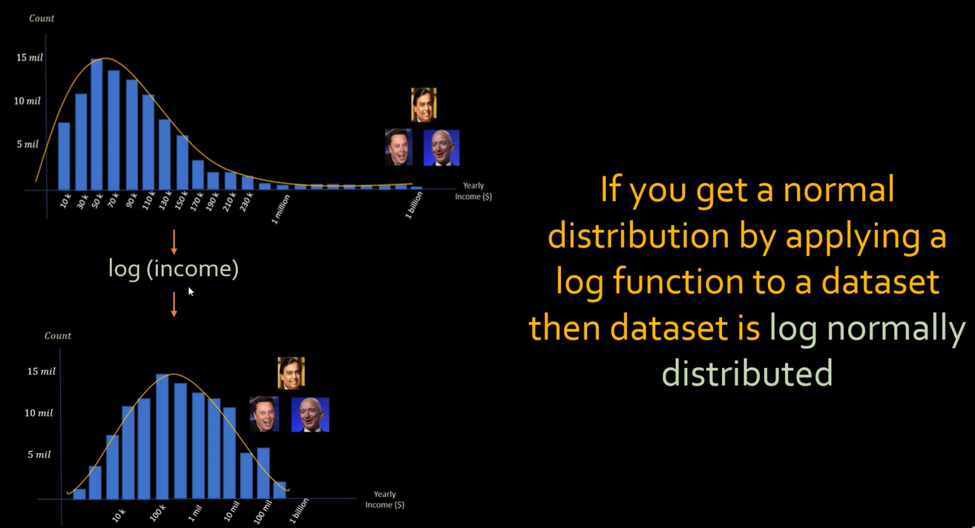

# Log Normal Distribution

**Video:** [Log normal distribution | Math, Statistics for data science, machine learning](https://www.youtube.com/watch?v=xtTX69JZ92w)

**Playlist:** [Mathematics, statistics for data science and machine learning](https://www.youtube.com/playlist?list=PLeo1K3hjS3uuKaU2nBDwr6zrSOTzNCs0l)

This note covers log normal distribution, why some datasets are right-skewed, and how applying a log transform can turn them into a more normal-looking distribution.

## What Problem Are We Solving?

Some datasets do not look symmetric like a bell curve. Instead, most values are small or moderate, and a few values become very large, creating a long right tail.

This matters because raw skewed values are harder to analyze, harder to visualize, and sometimes harder for ML models to learn from.

## Core Intuition

Normal distribution has values concentrated around the middle. Log normal distribution is different:

- The original data is right-skewed.
- If you take the log of the data, the transformed values become approximately normal.
- That is why the original data is called **log normal**.

A simple way to remember it:

**If log(data) looks normal, then data is log normal.**





## Normal vs Log Normal

| Distribution type | Shape | Typical example |
|---|---|---|
| Normal distribution | Symmetric bell shape | Test scores, employee performance |
| Log normal distribution | Right-skewed with long tail | Income, hospitalization days, advertising budget |

The key difference is that log normal data has a long right tail caused by a few very large values.

## Why Right Skew Happens

The video explains that income is a good example. Most people may earn around a common range, but a few people or companies earn much more.

| Example | Why it becomes skewed |
|---|---|
| Income | Most people earn moderate amounts, but a few earn extremely high amounts |
| Hospitalization days | Many patients stay a few days, but some stay for very long periods |
| Advertising budget | Small and medium companies spend less, but large companies may spend huge amounts |

This creates a long tail on the right side.

## Example: Income

Imagine an income dataset:

| Person | Income |
|---|---:|
| Rob | 80000 |
| Tom | 32000 |
| Xi | 77000 |
| Mohan | 65000 |
| Pooja | 550000 |
| Sofiya | 75000 |

Most values are in a similar range, but Pooja’s income is much larger. That one large value stretches the distribution to the right.

## What Log Does

Log compresses large values more than small values.

So if the original data has a long tail, log pulls the large values closer together and makes the distribution easier to work with.

That is why a right-skewed distribution can become more symmetric after log transform.



## Simple View of the Idea

| Before log | After log |
|---|---|
| Very large gap between small and large values | Gaps become more comparable |
| Tail stretches far to the right | Tail becomes shorter |
| Harder to compare values | Easier to analyze visually and numerically |

## Log Normal Definition

A distribution is called log normal if taking the log of the values gives a normal distribution.

Formula:

```text
If log(x) is normally distributed, then x is log normally distributed.
```

This is the central idea of the video.

## Real-Life Examples

The video gives several examples of log normal behavior.

| Example | Why it fits |
|---|---|
| Income | Few extremely high earners create a long tail |
| Hospitalization days | Most stays are short, but some are very long |
| Company advertising budgets | Many small budgets, a few huge budgets |

These examples are useful because they are not symmetric around a center like test scores often are.

## Why This Matters In Data Science

Log normal distributions matter because many ML models work better when numeric features are on a more comparable scale.

The video uses a loan approval example where income is one of the input features.

If one person has a much larger income than the rest, that feature can dominate the model unless transformed.

## Loan Approval Example

| Person | Credit score | Income | Age | Loan approved? |
|---|---:|---:|---:|---|
| Rob | 750 | 80000 | 32 | Y |
| Tom | 310 | 32000 | 45 | N |
| Xi | 475 | 77000 | 33 | Y |
| Mohan | 600 | 65000 | 51 | N |
| Pooja | 820 | 550000 | 35 | Y |
| Sofiya | 780 | 75000 | 31 | Y |

Pooja’s income is far larger than the others, so the raw income values are not on a similar scale.

## Log Transform For ML

The video shows creating a new feature called `log income`.

| Person | Income | Log income |
|---|---:|---:|
| Rob | 80000 | 4.903089987 |
| Tom | 32000 | 4.505149978 |
| Xi | 77000 | 4.886490725 |
| Mohan | 65000 | 4.812913357 |
| Pooja | 550000 | 5.740362689 |
| Sofiya | 75000 | 4.875061263 |

Now the values are closer together and easier to compare.

### Why this helps

- The model sees less extreme magnitude differences.
- The feature becomes easier to learn from.
- Visuals become easier to interpret.

## Code Idea

The video shows the distribution using pandas and seaborn.

```python
import pandas as pd
import seaborn as sns

sns.histplot(df['income'], kde=True)
```

Then the same data is viewed after applying a log transform.

```python
import numpy as np

df['log_income'] = np.log10(df['income'])
```

That new column is often more suitable for modeling and analysis.

## Log Scale On Plots

The video also shows that a bar chart with a log y-axis makes values more comparable when one bar is much larger than the others.

| Plot type | Result |
|---|---|
| Linear scale | Large values dominate the chart |
| Log scale | Smaller values become easier to compare |

This is especially useful in revenue-style datasets.

## When To Use Log Transform

| Situation | Why log helps |
|---|---|
| Right-skewed data | Compresses long tails |
| Large scale differences | Makes values more comparable |
| Revenue, income, budget data | Reduces dominance of huge values |
| Visual analysis | Improves chart readability |

## Important Caution

Log is useful, but not always valid.

- It cannot be applied directly to zero or negative values.
- It changes interpretation of the feature.
- It should be used when compression actually makes sense.

## ML Relevance

Log transform is common in machine learning because many real-world features are skewed.

Examples:

- Income
- Revenue
- Population
- Number of visits
- Advertising spend

These features often behave better after log transform.

## Deep Learning Relevance

Logarithmic thinking appears in deep learning in several places:

- Log loss
- Cross-entropy
- Softmax stability
- Feature preprocessing

So log is not just a visualization trick. It also appears in optimization and loss functions.

## Systems Engineering Relevance

In ML systems, log transforms help when:

- Monitoring skewed business metrics
- Building stable feature pipelines
- Visualizing large-scale operational data
- Detecting anomalies in highly uneven distributions

For example, a revenue or traffic dashboard often becomes more useful when plotted on a log scale.

## Common Mistakes

- Thinking log is only for math class.
- Applying it to values that can be zero or negative without adjustment.
- Forgetting that log changes the meaning of the feature.
- Using log even when the data is already roughly balanced.
- Confusing log normal with normal distribution.

## Key Takeaways

- Log normal distribution is right-skewed.
- If log of the data becomes normal, the original data is log normal.
- Income, hospitalization days, and ad budgets are common examples.
- Log transform compresses large values and improves comparability.
- It is useful in both visualization and machine learning.

## Revision Cheat Sheet

- **Normal distribution** = symmetric bell curve
- **Log normal distribution** = right-skewed original data
- **Log transform** = compresses large values
- **log(x) normal** => `x` is log normal
- Good for skewed numeric features

## 30-Second Revision

Log normal distribution is a right-skewed distribution where the log of the data looks normal. It commonly appears in income, hospitalization days, and ad budgets. Applying a log transform compresses the tail and makes the values easier to compare and model.

## 2-Minute Revision

A normal distribution is symmetric, but many real-world datasets are not. Income is a classic example because a few very large values stretch the right tail. If taking the log of the data makes the shape look normal, the original data is called log normal. This is why log transforms are popular in analysis and ML preprocessing.

## Interview Perspective

Common interview question: why use a log transform?

A strong answer: to reduce skew, compress large values, and make a feature more comparable for analysis or modeling.

Another common question: what is log normal distribution?

It is a distribution whose log-transformed values follow a normal distribution.

## Engineering Perspective

In real systems, many business metrics are highly skewed. Log transforms make dashboards, feature pipelines, and anomaly detection more stable and readable when values vary across a huge range.

## Next Topic Recommendation

The next topic is basic trigonometry: sin, cos, and tan. That will start a new branch of the playlist and connect geometry with ML ideas such as cosine similarity later.
