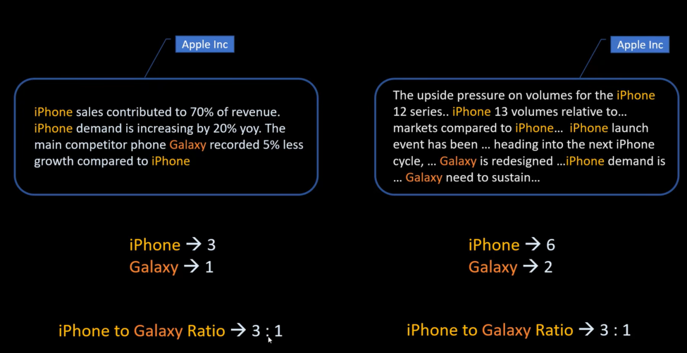
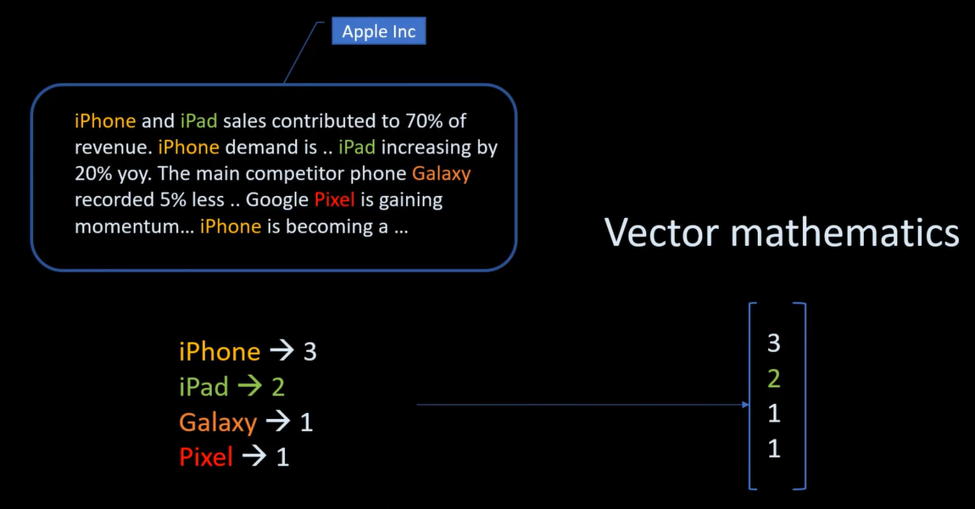
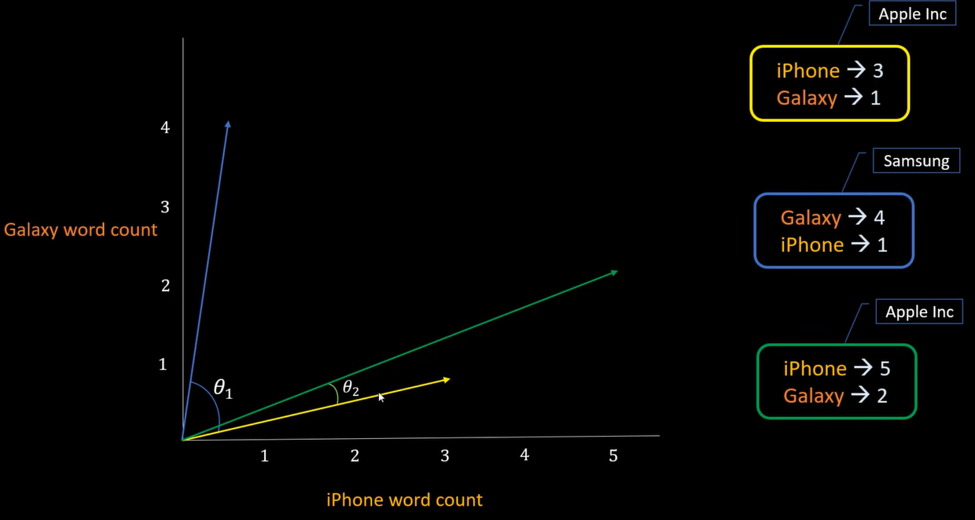
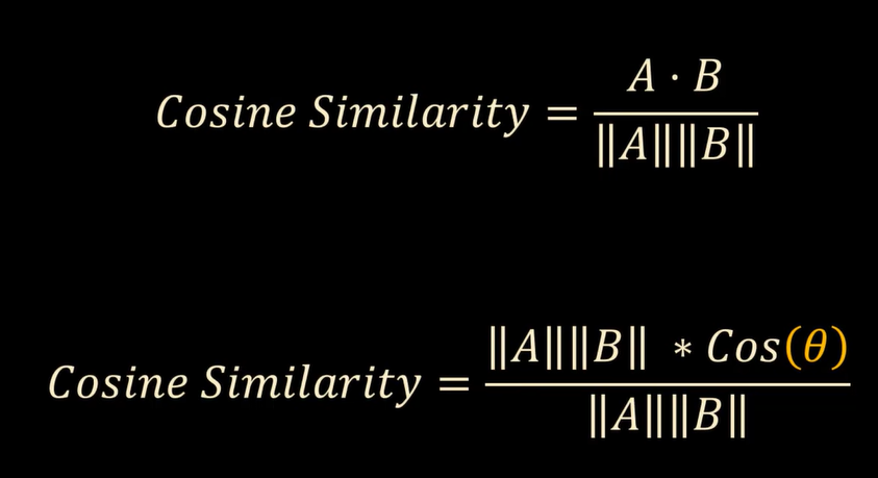

# Cosine Similarity and Cosine Distance

**Video:** [Cosine similarity, cosine distance explained | Math, Statistics for data science, machine learning](https://www.youtube.com/watch?v=m_CooIRM3UI)

**Playlist:** [Mathematics, statistics for data science and machine learning](https://www.youtube.com/playlist?list=PLeo1K3hjS3uuKaU2nBDwr6zrSOTzNCs0l)

This note covers cosine similarity and cosine distance using the document example from the video. The main idea is to measure how similar two vectors are based on direction rather than raw magnitude.

## What Problem Are We Solving?

At the start, the video uses simple word counts for just `iPhone` and `galaxy`. That works as a first intuition because one document can be compared with another using a 2D point.



This simple ratio idea is helpful as long as we are only comparing two words. But once more frequent words such as `iPad`, `Pixel`, or other topic words are added, the comparison becomes more complex. A ratio between two counts is no longer enough because the document is now described by many words at the same time. That is where vector comparison becomes useful.

This is important in text analysis because a document is usually not about just one or two words. It is a collection of many word frequencies, and cosine similarity compares that full vector instead of only one word pair.



## Core Intuition

Each document can be represented as a vector.

For the simple example in the video:

- x-axis = `iPhone` word count
- y-axis = `galaxy` word count

So a document with `iPhone = 3` and `galaxy = 1` becomes the vector `(3, 1)`.

Another document with `iPhone = 6` and `galaxy = 2` becomes `(6, 2)`.

These two vectors point in the same direction, so they are very similar even though one is longer.

When the vocabulary grows, the same idea extends to higher dimensions:

- `iPhone`
- `galaxy`
- `iPad`
- `Pixel`
- and many more terms

Then each document becomes a longer vector, and cosine similarity compares those vectors as a whole.

## Why Direction Matters

Cosine similarity focuses on the angle between vectors.

- Small angle → very similar
- Large angle → less similar
- 90 degree angle → unrelated in direction

This is useful because two documents can have different lengths but still talk about the same topic.



## Simple Example From The Video

| Document | iPhone count | galaxy count | Vector |
|---|---:|---:|---|
| Apple-like doc A | 3 | 1 | `(3, 1)` |
| Apple-like doc B | 6 | 2 | `(6, 2)` |
| Similar Apple doc C | 5 | 1 | `(5, 1)` |
| Samsung-like doc D | 1 | 4 | `(1, 4)` |

Observation:

- `(3, 1)` and `(6, 2)` point in the same direction, so they are highly similar.
- `(3, 1)` and `(5, 1)` are still similar, but not identical.
- `(3, 1)` and `(1, 4)` form a much larger angle, so they are much less similar.

## Why The Higher-Dimensional View Is Needed

If we only compare two words like `iPhone` and `galaxy`, a simple ratio can be enough for a rough comparison.

But in real text:

- `iPhone` may appear frequently.
- `galaxy` may appear frequently.
- `iPad`, `Pixel`, and other words also appear.
- Some words may be common across all documents.

At that point, a single ratio no longer captures the full meaning of the document. A vector representation is better because it preserves all the word counts together.

That is the main reason cosine similarity is used in text similarity.

## Why Angle Is Better Than Raw Counts

Suppose one document is longer and mentions all terms more times. Raw counts increase, but the topic may still be the same.

Cosine similarity handles that well because it asks:

**Are these vectors pointing in a similar direction?**

That makes it a better similarity measure than comparing absolute counts directly.

## From Angle To Similarity Score

The video explains that an angle like 17 degrees is not very intuitive for business use. A score between 0 and 1 is easier to interpret.

That is why cosine is used.

If the angle between two vectors is 17 degrees, then:

- `cos(17°) ≈ 0.95`

A similarity of `0.95` is much easier to understand than saying “the angle is 17 degrees.”

## Cosine Similarity Definition

Cosine similarity is the cosine of the angle between two vectors.

Formula:

```text
Cosine Similarity = cos(theta)
```

In vector form:

Formula:

```text
Cosine Similarity = (A . B) / (||A|| * ||B||)
```

Where:

- `A . B` is the dot product
- `||A||` is the magnitude of vector A
- `||B||` is the magnitude of vector B

This formula works not only for 2D examples but also for high-dimensional vectors used in real ML systems.



## Meaning Of The Score

| Angle between vectors | Cosine similarity | Meaning |
|---|---:|---|
| 0 degrees | 1 | Exactly same direction, very similar |
| 90 degrees | 0 | No directional similarity |
| 180 degrees | -1 | Opposite direction |

For document similarity, values closer to `1` mean stronger similarity.

## Cosine Distance

Cosine distance is a related concept.

Formula:

```text
Cosine Distance = 1 - Cosine Similarity
```

That means:

| Cosine similarity | Cosine distance | Meaning |
|---|---:|---|
| 1 | 0 | Very similar |
| 0 | 1 | Very different in direction |

Distance is often easier to use when a system wants a “how far apart?” measure instead of a “how similar?” score.

## Document Example In Table Form

The video later uses four small documents and pre-counts the `iPhone` and `galaxy` words. This is the simple two-word version of the idea; the same logic extends to larger vectors when more words are counted.

| Document | iPhone | galaxy |
|---|---:|---:|
| doc1 | 3 | 1 |
| doc2 | 2 | 0 |
| doc3 | 1 | 3 |
| doc4 | 1 | 2 |

Interpretation:

- `doc1` and `doc2` are more Apple-like.
- `doc3` and `doc4` are more Samsung-like.

## Expected Similarity Pattern

| Pair | Expected similarity |
|---|---|
| doc1 vs doc2 | High |
| doc3 vs doc4 | High |
| doc1 vs doc3 | Lower |

This matches the idea that documents from the same topic tend to point in similar vector directions.

## Numeric Examples From The Video

### Example 1

```python
cosine_similarity([[3,1]], [[6,2]])
```

Result:

```text
1.0
```

These two vectors are perfectly aligned, so their cosine similarity is `1`.

### Example 2

```python
cosine_distances([[3,1]], [[6,2]])
```

Result:

```text
very close to 0
```

The notebook output is a tiny floating-point value close to zero, which effectively means zero distance.

### Example 3

```python
cosine_similarity([[3,1]], [[3,2]])
```

Result:

```text
0.96476382
```

This is still very high, so the documents are still similar, but not identical in direction.

## Python Example Used In The Lecture

```python
from sklearn.metrics.pairwise import cosine_similarity, cosine_distances

cosine_similarity([[3,1]], [[6,2]])
cosine_distances([[3,1]], [[6,2]])
cosine_similarity([[3,1]], [[3,2]])
```

For the document dataframe:

```python
import pandas as pd

df = pd.DataFrame([
    {'iPhone': 3, 'galaxy': 1},
    {'iPhone': 2, 'galaxy': 0},
    {'iPhone': 1, 'galaxy': 3},
    {'iPhone': 1, 'galaxy': 2},
], index=['doc1', 'doc2', 'doc3', 'doc4'])
```

Then compare document rows using cosine similarity.

## Why Cosine Similarity Is So Useful

Cosine similarity is popular because it works well when magnitude should not dominate meaning.

For text data, a longer document may simply repeat the same topic more often. Cosine similarity still captures topical closeness because the direction remains similar.

## ML Relevance

Cosine similarity appears a lot in machine learning and data science.

Common use cases:

- Document similarity
- Text classification support features
- Recommendation systems
- Embedding comparison
- Semantic search
- Clustering high-dimensional data

It is especially useful when vectors represent patterns or topics rather than physical lengths.

## Deep Learning Relevance

In deep learning, cosine similarity is heavily used with embeddings.

Examples:

- Sentence embeddings
- Product embeddings
- User-item matching
- Retrieval systems
- RAG pipelines

When two embeddings point in similar directions, they usually represent semantically similar content.

## Systems Engineering Relevance

For ML systems, cosine similarity shows up in practical components such as:

- Vector databases
- Nearest-neighbor retrieval
- Search ranking
- Duplicate detection
- Recommendation serving

This is one of the most practical math topics in the playlist because it directly connects to production AI systems.

## Common Mistakes

- Assuming larger vector magnitude always means higher similarity.
- Confusing cosine similarity with Euclidean distance.
- Forgetting that cosine looks at direction, not just size.
- Treating a low cosine score as always “bad” without context.
- Ignoring feature representation before computing similarity.

## Key Takeaways

- Cosine similarity measures how close two vectors are in direction.
- It is the cosine of the angle between vectors.
- `1` means same direction, `0` means no directional similarity, `-1` means opposite direction.
- Cosine distance is `1 - cosine similarity`.
- It is widely used in document analysis, embeddings, search, and recommendation systems.

## Revision Cheat Sheet

- **Vector** = numeric representation of an item
- **Cosine similarity** = direction-based similarity
- **Cosine distance** = 1 - cosine similarity
- Same direction => similarity near 1
- Larger angle => lower similarity
- Great for text and embeddings

## 30-Second Revision

Cosine similarity measures the angle-based similarity between two vectors. If two vectors point in the same direction, similarity is close to 1. Cosine distance is the opposite view: it tells how far apart they are using `1 - similarity`.

## 2-Minute Revision

Documents can be represented as vectors using word counts or other features. At a simple level, you can compare just two words like `iPhone` and `galaxy`, but real documents contain many words, so the comparison becomes higher-dimensional. Cosine similarity compares the angle between those vectors instead of comparing raw counts directly. That makes it useful for document comparison, embeddings, recommendation systems, and semantic search, where direction often matters more than magnitude.

## Interview Perspective

Common interview question: why use cosine similarity instead of Euclidean distance?

A strong answer: because cosine similarity focuses on direction, so it works well when magnitude differences should not dominate the meaning, such as in text or embeddings.

Another common question: what is cosine distance?

It is `1 - cosine similarity`, a distance-style way to represent how dissimilar two vectors are.

## Engineering Perspective

In modern ML systems, cosine similarity is everywhere: vector search, semantic retrieval, recommendation, deduplication, and embedding-based ranking. It is one of the most directly useful math concepts for AI systems engineering.

## Next Topic Recommendation

The next natural topic is A/B testing or modified z-score, depending on which branch of the playlist you want to continue from next.
