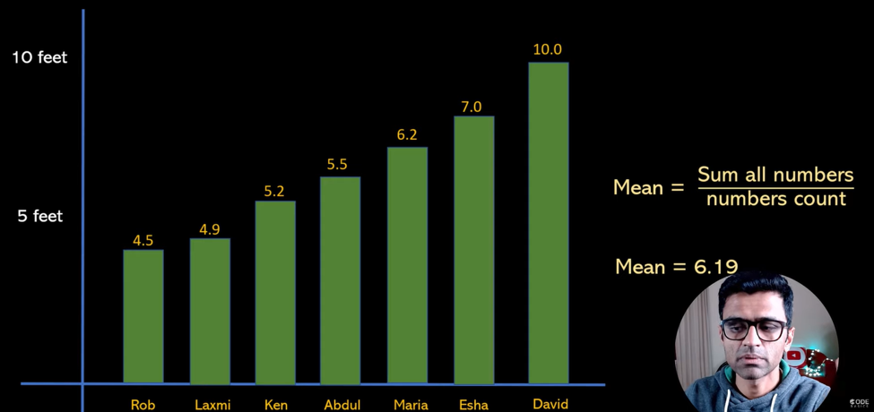
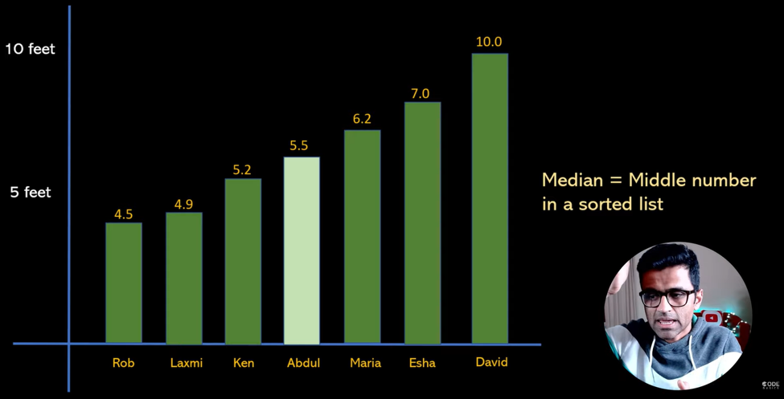
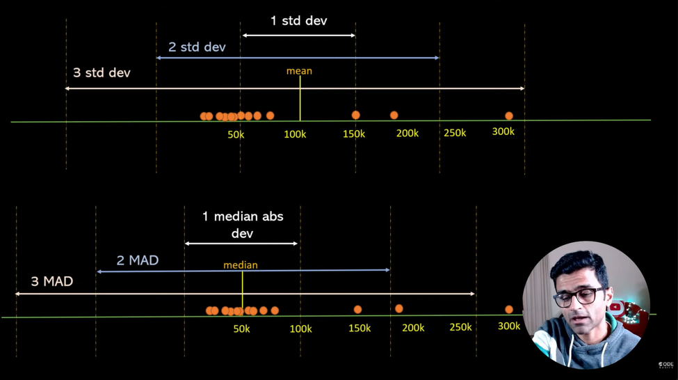
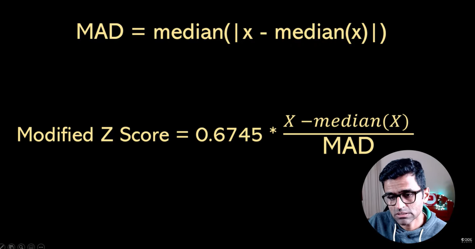
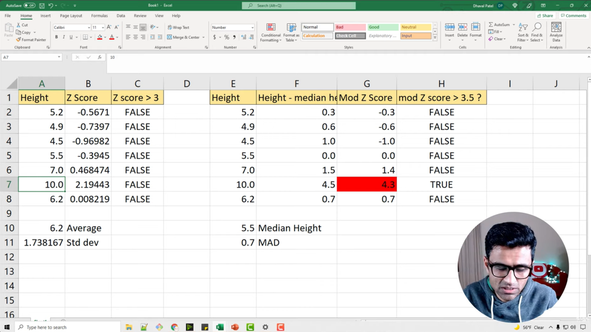

# Modified Z Score

**Video:** [Simple explanation of Modified Z Score | Modified Z Score to detect outliers with python code](https://www.youtube.com/watch?v=m7KWxX23zCU)

**Playlist:** [Mathematics, statistics for data science and machine learning](https://www.youtube.com/playlist?list=PLeo1K3hjS3uuKaU2nBDwr6zrSOTzNCs0l)

This note explains modified z-score as a robust outlier detection method, especially when a small dataset has extreme values that distort the mean and standard deviation.

## What Problem Are We Solving?

The usual z-score method can miss outliers when the mean and standard deviation are pulled by extreme values.

That is a problem when you want to detect unusual points in small datasets, because one large value can hide itself by shifting the average.

Modified z-score solves this by using the median and MAD instead of mean and standard deviation.





## Core Intuition

Think of the median as a more stable center point.

If one value is extremely large, the mean moves toward it. The median usually does not move much.

So modified z-score asks:

**How far is this value from the median, compared with the typical median-based spread of the data?**



## The Big Idea

| Method | Center used | Spread used | Sensitive to outliers? |
|---|---|---|---|
| Z-score | Mean | Standard deviation | Yes |
| Modified z-score | Median | MAD | Much less |

This is why modified z-score is often better when the data is small and outliers are present.

## Key Formulas

Formula:

```text
MAD = median(|x - median(x)|)
```

Formula:

```text
Modified Z Score = 0.6745 * (x - median(x)) / MAD
```

The video also uses the threshold:

```text
If |modified z score| > 3.5, treat the value as an outlier
```



## Why Not Just Use Z-Score?

The video first shows a height example.

| Height | Comment |
|---|---|
| 5.2 | Normal |
| 4.9 | Normal |
| 4.5 | Normal |
| 5.5 | Normal |
| 7.0 | High but still plausible |
| 10.0 | Very suspicious |
| 6.2 | Normal |

Using regular z-score, the 10.0 value does not always cross the threshold because it shifts the mean and standard deviation.

So the method fails to flag the obvious outlier.

## Modified Z-Score On Heights

For the same height dataset:

- Median height = 5.5
- MAD = 0.7

The modified z-score highlights the 10.0 value much more clearly.

| Height | Modified z-score | Outlier? |
|---|---:|---|
| 5.2 | -0.3 | No |
| 4.9 | -0.6 | No |
| 4.5 | -1.0 | No |
| 5.5 | 0.0 | No |
| 7.0 | 1.4 | No |
| 10.0 | 4.3 | Yes |
| 6.2 | 0.7 | No |

That is the main lesson: modified z-score catches the extreme point better.



## Why This Works Better

The median does not get pulled strongly by large values. MAD also uses median-based spread, so it stays stable even when one or two values are extreme.

That makes modified z-score especially useful for:

- small datasets,
- skewed datasets,
- datasets with obvious extreme outliers.

## Movie Revenue Example

The video then applies the same idea to movie revenues.

A small movie dataset is converted into millions to make analysis easier.

| Movie | Revenue in millions |
|---|---:|
| Avatar | very large |
| Jurassic World | very large |
| The Bodyguard | large |
| Others | smaller |

Regular z-score detects only one outlier because the mean and standard deviation are affected by the very large revenue values.

Modified z-score uses median and MAD, so it detects more likely outliers.

## Why Convert To Millions

The video converts revenue into millions so the numbers are easier to read and compare.

That does not change the distribution shape. It just makes the values more human-friendly for analysis.

## Python Workflow From The Video

### 1. Convert revenue to millions

```python
df['revenue_mln'] = df['revenue'].apply(lambda x: x / 1000000)
```

### 2. Compute mean and standard deviation for z-score

```python
_, mean, std, *_ = df.revenue_mln.describe()
```

### 3. Create z-score column

```python
df['zscore'] = df['revenue_mln'].apply(lambda x: (x - mean) / std)
```

### 4. Filter outliers using z-score

```python
df[df.zscore > 3]
```

This finds only the most extreme revenue outlier in the example.

### 5. Compute median and MAD

```python
import numpy as np

median = np.median(df.revenue_mln)
mad = np.median(np.abs(df.revenue_mln - median))
```

### 6. Create modified z-score column

```python
df['mod_zscore'] = df['revenue_mln'].apply(
    lambda x: 0.6745 * (x - median) / mad
)
```

### 7. Filter outliers using modified z-score

```python
df[df.mod_zscore > 3.5]
```

This returns more candidate outliers than standard z-score.

## Thresholds

| Method | Common threshold |
|---|---|
| Z-score | 3 |
| Modified z-score | 3.5 |

These are not absolute laws. They are practical rules of thumb.

## Why The Threshold Matters

The video emphasizes that there is no one perfect rule.

Sometimes a very large value is a real business value, not a data error.

So the outlier label depends on the use case.

For example:

- A 10-foot human height is not realistic.
- A very large movie revenue can be real and valid.

The method helps flag values for review, not automatically delete them.

## Comparison With Regular Z-Score

| Aspect | Z-score | Modified z-score |
|---|---|---|
| Uses mean? | Yes | No |
| Uses median? | No | Yes |
| Uses standard deviation? | Yes | No |
| Uses MAD? | No | Yes |
| Works better with outliers? | Not always | Yes |

This is the key reason modified z-score is often preferred for outlier detection in small or skewed datasets.

## ML Relevance

Outlier detection matters in ML because extreme values can distort feature scaling, model training, and threshold-based decisions.

Modified z-score is useful when you want a more robust alternative to standard z-score.

## Systems Engineering Relevance

In data pipelines, modified z-score can help with:

- detecting abnormal sensor readings,
- checking suspicious business metrics,
- validating incoming data,
- flagging records for manual review.

It is especially useful when the dataset is too small for mean-based methods to be stable.

## Common Mistakes

- Using z-score blindly on small datasets with outliers.
- Deleting all flagged values without checking business meaning.
- Forgetting that modified z-score uses median and MAD.
- Assuming 3.5 is a hard law instead of a guideline.
- Confusing an extreme but valid value with a data error.

## Key Takeaways

- Regular z-score can fail when outliers shift mean and standard deviation.
- Modified z-score uses median and MAD, which are more robust.
- A common threshold for modified z-score is 3.5.
- It works well for small datasets and skewed data.
- Outlier detection should always consider business context.

## Revision Cheat Sheet

- **MAD** = median absolute deviation.
- **Modified z-score** = robust z-score based on median and MAD.
- **Threshold** = about 3.5.
- **Better than regular z-score** when outliers affect mean and standard deviation.
- **Goal** = flag likely outliers, not blindly delete them.

## 30-Second Revision

Modified z-score is a robust way to detect outliers. It uses median and MAD instead of mean and standard deviation, so it is less affected by extreme values. A common rule is that values with modified z-score above 3.5 are likely outliers.

## 2-Minute Revision

Regular z-score can fail when the mean and standard deviation are pulled by extreme values. Modified z-score fixes that by using the median as the center and MAD as the spread measure. In the video, this catches the obvious height outlier better and finds more suspicious movie revenue values than regular z-score. It is a practical option when the dataset is small or skewed.

## Interview Perspective

Common interview question: why use modified z-score instead of z-score?

A strong answer: because modified z-score is more robust to outliers since it uses median and MAD, which are not heavily affected by extreme values.

Another common question: what threshold is used?

A common practical threshold is 3.5, but it should be adjusted based on the problem.

## Engineering Perspective

In production data pipelines, modified z-score is a good first-pass anomaly detector when values are skewed or the sample size is small. It can help surface suspicious rows for review without relying too much on unstable averages.
